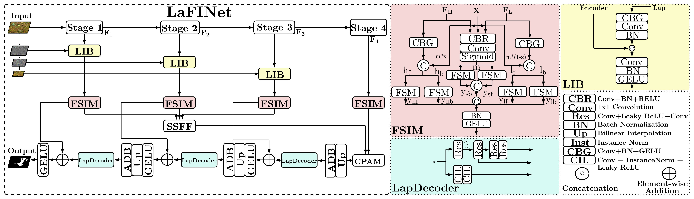

# LaFINet

### Laplacian-Based Frequency Injection Network for Camouflage Object Detection

**AAAI 2026 · Student Abstract**<br>
Aravinthakshan A S · Aditya Prashant Naidu · Aadiv Rath<br>
Manipal Institute of Technology, Manipal Academy of Higher Education

**[Paper](https://ojs.aaai.org/index.php/AAAI/article/view/42179)** · **[PDF](https://ojs.aaai.org/index.php/AAAI/article/download/42179/46140)** · **[DOI](https://doi.org/10.1609/aaai.v40i48.42179)** · **[Latest development branch](https://github.com/aravinthakshan/LaFINet/tree/aditya-branch2)**

LaFINet studies how multiscale Laplacian details can help a lightweight network segment objects that blend into their surroundings. The published architecture combines Laplacian injection, frequency modulation, and feature fusion to recover object structure and boundaries.

## Architecture



*Figure 1, reproduced without modification from the published paper. [Open full-resolution figure](docs/lafinet-architecture.png). Copyright © 2026 Association for the Advancement of Artificial Intelligence.*

1. **Extract detail:** a three-level Laplacian pyramid supplies cues at different scales.
2. **Inject and modulate:** Laplacian Injection Blocks (LIBs) combine these cues with EfficientNet-B0 features; FSIM modulates frequency information.
3. **Fuse and decode:** LapDecoders, Scaled Sequence Feature Fusion (SSFF), and channel/position attention (CPAM) combine features for segmentation.

## Which branch should I use?

`main` is the default branch, but it is **not the newest model implementation**. The following code snapshots were reviewed on 25 September 2026:

| Branch | Reviewed commit | Commit date | Context |
| --- | --- | --- | --- |
| `main` | [`718ac5e`](https://github.com/aravinthakshan/LaFINet/commit/718ac5e) | 28 Nov 2025 | Earlier experimental implementation; SSFF/ASF calls are commented out and GOLD-style blocks are active. |
| `aditya-branch` | [Branch history](https://github.com/aravinthakshan/LaFINet/commits/aditya-branch) | 7 Dec 2025 | Intermediate development. |
| `aditya-branch2` | [`185a6f0`](https://github.com/aravinthakshan/LaFINet/commit/185a6f0) | 10 Jul 2026 | Most recent development: active scale fusion/attention, a model factory, additional backbones, and further architectural experiments. |

The newest branch also includes changes beyond the published architecture. **Neither snapshot is presented here as a verified reproduction of the paper.** A paper-specific commit, checkpoint, and pinned environment still need to be identified before claiming exact reproduction of the reported numbers.

## Published results

Transcribed from **Table 1** and the parameter-count paragraph in the paper. Higher metric values are better. Bold marks the best score among these methods, including ties. These numbers are published results, not measurements rerun against the current branch.

| Method | Parameters | CHAMELEON Sα ↑ | Eφᵈ ↑ | Fβʷ ↑ | NC4K Sα ↑ | Eφᵈ ↑ | Fβʷ ↑ |
| --- | ---: | ---: | ---: | ---: | ---: | ---: | ---: |
| SINetV2 | 24.9M | 0.888 | 0.930 | 0.816 | **0.847** | 0.901 | 0.770 |
| TinyCOD | 4.72M | 0.887 | 0.931 | 0.814 | 0.843 | 0.903 | 0.766 |
| FINet | 3.74M | 0.883 | 0.928 | 0.808 | **0.847** | 0.904 | 0.771 |
| LaFINet | 4.48M | **0.892** | **0.940** | **0.829** | 0.845 | **0.906** | **0.772** |

LaFINet improves all three CHAMELEON scores in this comparison. On NC4K, its structure score is slightly below FINet and SINetV2, while its E and weighted F scores are higher.

## Explore the code

Links below point to the reviewed development snapshot:

| File | Purpose |
| --- | --- |
| [`Model/LAFinet.py`](https://github.com/aravinthakshan/LaFINet/blob/185a6f0/Model/LAFinet.py) | `LaplacianFINet` and experimental architecture options |
| [`Model/lap_utils.py`](https://github.com/aravinthakshan/LaFINet/blob/185a6f0/Model/lap_utils.py) | Pyramid decomposition, injection, fusion, and attention utilities |
| [`Model/model_factory.py`](https://github.com/aravinthakshan/LaFINet/blob/185a6f0/Model/model_factory.py) | Model names and supported backbone choices |
| [`train.py`](https://github.com/aravinthakshan/LaFINet/blob/185a6f0/train.py) | Training and checkpoint creation |
| [`inference.py`](https://github.com/aravinthakshan/LaFINet/blob/185a6f0/inference.py) | Prediction-map generation |
| [`evaluate.py`](https://github.com/aravinthakshan/LaFINet/blob/185a6f0/evaluate.py) | Evaluation of saved prediction maps |
| [`config.py`](https://github.com/aravinthakshan/LaFINet/blob/185a6f0/config.py) | Dataset paths and training settings |

## Getting started with the development branch

The commands below match the CLI at `185a6f0`. They are starting points for experiments, **not a tested paper-reproduction recipe**. Training and inference have not been rerun as part of this documentation update.

```bash
git clone https://github.com/aravinthakshan/LaFINet.git
cd LaFINet
git switch aditya-branch2
# For the exact snapshot documented here:
git checkout 185a6f0

python -m venv .venv
source .venv/bin/activate
```

Install a compatible **PyTorch + torchvision** pair for your hardware using the [official PyTorch instructions](https://pytorch.org/get-started/locally/). Other imports used by this branch include:

```bash
python -m pip install numpy Pillow opencv-python tqdm timm torch-dct pysodmetrics einops kornia wandb pandas
```

There is no pinned dependency environment in this snapshot. `Config.CUDA` defaults to `True`; select an appropriate device in `config.py`. Pretrained backbones can download weights on first use.

### Data

Set `dataset_dir` and `DataPath` in `config.py` to your own data location. The current loader expects this nested layout:

```text
<dataset_dir>/
├── COD-TrainDataset/COD-TrainDataset/
│   ├── Imgs/
│   └── GT/
└── COD-TestDataset/COD-TestDataset/
    ├── CHAMELEON/{Imgs,GT}/
    ├── CAMO/{Imgs,GT}/
    ├── COD10K/{Imgs,GT}/
    └── NC4K/{Imgs,GT}/
```

Use the [SINet-V2 dataset resources](https://github.com/GewelsJI/SINet-V2) and follow the datasets’ own usage terms. Run scripts from the repository root so relative resources, including `utils/freq_mean_std.pkl`, resolve correctly.

### Train, predict, evaluate

The paper reports Adam, 200 epochs, cosine decay, and an initial learning rate of **0.001**. Development defaults differ: the CLI defaults to SOAP, and `config.py` sets **0.00026**. Selecting Adam alone does not make the current architecture or settings match the paper.

```bash
python train.py --model LAFinet --backbone efficientb0 \
  --optimizer adam --scheduler cosine --save_dir ./checkpoints --disable_wandb

python inference.py --model LAFinet --backbone efficientb0 \
  --ckpt ./checkpoints/LAFinet_efficientb0_epoch200.pth \
  --datasets CHAMELEON NC4K --disable_wandb

python evaluate.py --model LAFinet --backbone efficientb0 \
  --pred_dir ./prediction_maps --datasets CHAMELEON NC4K --disable_wandb
```

Use a checkpoint produced by the same model/backbone configuration. Inference expects a checkpoint dictionary containing a `model` state dictionary. To use W&B, configure your own project/entity and authenticate through `WANDB_API_KEY` or `wandb login`; never commit credentials.

**Weights:** this README does not advertise a verified LaFINet paper checkpoint. The old README’s FINet weight and prediction-map links belong to the upstream baseline and must not be labelled as LaFINet results.

## Citation

```bibtex
@article{aravinthakshan2026lafinet,
  title   = {LaFINet: Laplacian-Based Frequency Injection Network for Camouflage Object Detection (Student Abstract)},
  author  = {Aravinthakshan A S and Aditya Prashant Naidu and Aadiv Rath},
  journal = {Proceedings of the AAAI Conference on Artificial Intelligence},
  year    = {2026},
  volume  = {40},
  number  = {48},
  pages   = {41107--41109},
  doi     = {10.1609/aaai.v40i48.42179},
  url     = {https://ojs.aaai.org/index.php/AAAI/article/view/42179}
}
```

## Acknowledgements

This repository builds on **[FINet by Liang et al.](https://github.com/CRRCOO/FINet)**, “Frequency Injection Network for Lightweight Camouflaged Object Detection,” *IEEE Signal Processing Letters*, 2024, [DOI: 10.1109/LSP.2024.3356416](https://doi.org/10.1109/LSP.2024.3356416). The original README and the existing `imgs/FINet.png`, `imgs/results.png`, and `imgs/vis.png` describe that upstream work. They are not LaFINet’s architecture or experimental results.

Please credit the upstream work when using its code. The paper also references [SINet-V2](https://github.com/GewelsJI/SINet-V2), CamoFocus, and ASF-YOLO. This documentation does not introduce a new license or change the rights attached to upstream code, datasets, or the published figures.
